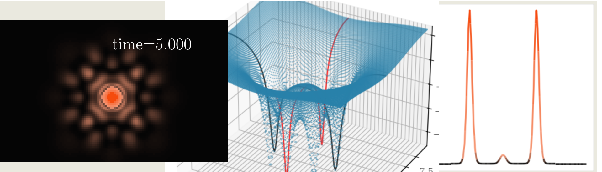

    

# Euskera time-evolution Schrodinger-Poisson/Gross-Pitaevskii-Poisson

This repository presents a numerical Python code based on the public code [PyUltraLight](https://github.com/auckland-cosmo/PyUltraLight), which corresponds to a time-space evolution of the Schrödinger-Poisson system. The *Euskera* code generalizes the previous one by introducing a self-interaction term (which corresponds to the Gross-Pitaevskii-Poisson equation) and includes the possibility of working with multi-frequency Proca stars and boson stars. The details of the mathematical procedure are presented and discussed in ...

> [!IMPORTANT]
In order for the code to work correctly, the following packages are required:

> Main codec
- [NumPy](https://numpy.org)
- [NumExpr](https://numexpr.readthedocs.io/en/latest/user_guide.html)
- [Numba](https://numba.pydata.org)
- [pyFFTW](https://pyfftw.readthedocs.io/en/latest/#introduction)

> Plotting routines:
- [Matplotlib](https://matplotlib.org).

> To generate a video:
- [FFmpeg](https://www.ffmpeg.org)

By default, the code saves the output data in “npz” format, but [h5py](https://www.h5py.org) is also available if the respective packages are installed. Other packages such as os, sys, and multiprocessing are used, but they are included in Python versions higher than 2.6.

***

> [!NOTE]
The published materials include:

> [Main module](/euskera/)

> [Illustrative examples](/examples/)

> [Numerical radial profiles](/Soliton%20Profile%20Files/)

Additionally, we include some [script](/scripts/) implementations.

If our code contributes to a project that leads to a publication, please acknowledge our work by citing it.

## Contact
You can contact via email: alberto.diez(at)fisica.ugto.mx / arestrada(at)fisica.uaz.edu.mx / arestrada(at)fisica.ugto.mx