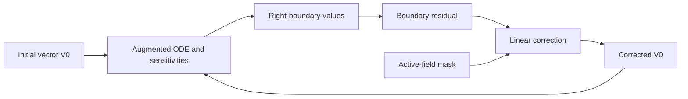

# Background fitting workflow

Fitting is a separate operation from shooting. It starts with a numerical
solution or an initial parameter vector and corrects unknown initial values so
that selected conditions are satisfied at the outer boundary.

The implementation is in
[`euskera.backgrounds.fitting`](../../euskera/backgrounds/fitting.py).



The function is designed for systems whose state vector contains the physical
variables together with sensitivity equations. The boolean masks `indck`,
`indXc` and `inddXc` identify, respectively, unknown initial parameters,
right-boundary variables and their sensitivity components.

## Active fields

Pass `active` to exclude fields that are identically zero. This boolean mask
has one entry per selected unknown and boundary equation, in matching order.
It reduces only the algebraic correction; the augmented state and the masks
`indck`, `indXc` and `inddXc` keep their full sizes. Inactive unknowns are set
to zero. With `active=None` (the default), the full system is solved; zeros in
the right-hand side never remove an equation automatically. Convergence still
checks all selected boundary conditions.

The [multifrequency background notebook](../../examples/backgrounds/example_making_initial_profile_multifrequency.ipynb) carries central amplitudes
from shooting into the fitting loop. With zero initial field derivatives, it
derives the mask once per configuration:

```python
active = np.array([p0x, p0y, p0z]) != 0
V0fit = bg.fitting(
    bg.systemMultFreqTot, V0, indck, indXc, BCind, inddXc, limit,
    argf=arg, tol=1e-18, met=met, Rtol=Rtol, Atol=Atol,
    active=active,
)
```

For `[0.81, 0.2, 0]`, the mask is `[True, True, False]`. The corrected state
still contains 48 entries and can feed the existing profile and extension
steps. A field is not inactive merely because it crosses zero or has a small
amplitude. For other initial conditions, supply an explicit mask describing
the identically zero fields. Selected inactive equations must be consistent
with fixing their corresponding unknowns to zero.

This is not a statistical curve fit. The correction minimizes the residual
of the boundary conditions for the ODE problem. The physical equations still
come from the background model described in
[Background solutions](../theory/background-solutions.md).
