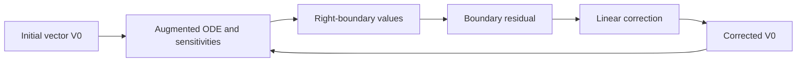

# Background fitting workflow

Fitting is a separate operation from shooting. It starts with a numerical
solution or an initial parameter vector and corrects unknown initial values so
that selected conditions are satisfied at the outer boundary.

The implementation is in
[`euskera.backgrounds.fitting`](../../euskera/backgrounds/fitting.py).

The function is designed for systems whose state vector contains the physical
variables together with sensitivity equations. The boolean masks `indck`,
`indXc` and `inddXc` identify, respectively, unknown initial parameters,
right-boundary variables and their sensitivity components.

This is not a statistical curve fit. The correction minimizes the residual
of the boundary conditions for the ODE problem. The physical equations still
come from the background model described in
[Background solutions](../theory/background-solutions.md).

