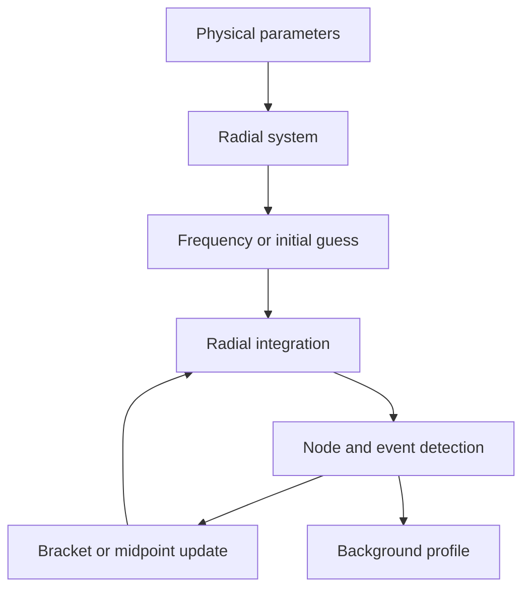

# Background shooting workflow

This workflow constructs radial background solutions from the equations and
boundary conditions described in [Background solutions](../theory/background-solutions.md).



The shooting stage and the fitting stage are separate. Shooting selects the
frequency or interval that produces the desired event and node structure.
Fitting, when needed, corrects unknown initial parameters using the
boundary-value method described in
[Boundary-value numerical method](../methods/boundary-value-method.md).

Relevant modules:

```python
from euskera.backgrounds import profiles, shooting, systems
```

After a profile is constructed, use the background observables and plotting
helpers to inspect it before passing it to a dynamical simulation.

