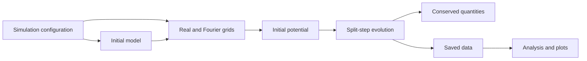

# Dynamical simulation workflow

The simulation workflow evolves a three-dimensional initial configuration in
time. It is independent from the radial background workflow, although a
background profile can be used to build the initial model.



The principal public configuration objects are:

```python
from euskera import DiagnosticsConfig, EvolutionConfig, OutputConfig
```

The relevant implementation namespaces are:

| Responsibility | Namespace |
| --- | --- |
| Grids and shared field primitives | `euskera.core` |
| Initial models | `euskera.models` |
| Time evolution and potential | `euskera.evolution` |
| Simulation diagnostics | `euskera.observables` |
| Saving and loading | `euskera.io` |
| Simulation plots | `euskera.visualization` |

Use the background workflow first when the initial condition must be a
numerically constructed radial profile. Otherwise, an analytic model can be
used directly.


## Output by variable, geometry, and time

See [selective output](../selective-output.md) for `SaveRule`, `All`, `Last`, `TimeRange`, `Final`, independent diagnostics, all three planes and axes, and reading actual coordinates.
